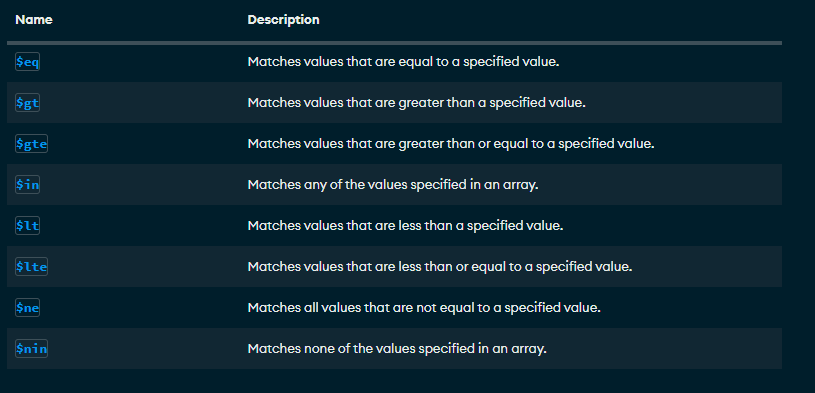
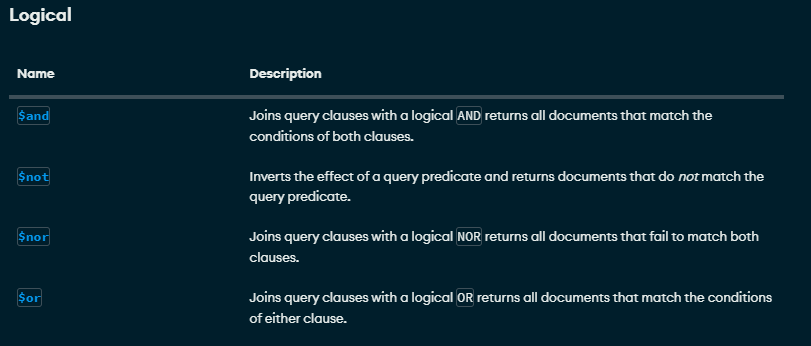

# Crud y consultas en MongoDB

## Crear una base de datos
Solo se crea si contiene una base de datoscolleccion

**use db1**

##Como crear una colleccion
use db1 
db.createCollection('alumnos')

##Mostrar las collecciones
show collections

##Insertar un documento
```json
db.alumnos.insertOne(
{
  nombre:'Soyla',
  apellido1:'Vaca',
  edad:32,
  ciudad:'San Miguel de las Priedras'
}
)

##Insercion de un documento mas complejo con array 
```json
db.alumnos.insertOne(
{
nombre:'Erick',
apellido:'Trejo',
apellido2:'Gerrero',
edad:15,
aficiones:[
'fut','juegos','motos'
]
}
)

## Insercion de documentos mas complejos con documentos anidados y ID

```json
db.alumnos.insertOne(
{
    nombre:'Jose Luis',
    apellido1:'Herrera',
    apellido2:'Gallardo',
    edad:41,
    estudios:[
        'INg en Sistemas Computacionales',
        'Maestria en Tecnologias de la Informacion'
    ],
experiencia:{
    lenguaje:'SQL',
    abd:'SQL Server',
    experiencia:14
}
}
)

## 
db.alumnos.insertOne(
{
    _id:3,
    nombre:'Sergio',
    apellidos:'Ramos',
    equipo:'Monterrey',
    aficiones:['Dinero','Hombres','Fiesta'],
    taleentos:{
        fultol:true,
        bananse:false
    }
}
)

## Insertar Multiples Documentos
db.alumnos.insertMany(
[
    {
        _id:12,
        nombre:'Roberto',
        apellido:'Gomez',
        edad:'23',
        descrpcion:'Es un comediante bueno'
    },
    {
        nombre:'Luis',
        apellido:'Suarez',
        edad:43,
        habilidades:[
            'Correr','dormir','Morder'
        ],
        direccioned{
            calle:'Del infierno',
            numero:666,
        },
        esposas:[
            {
                nombre:'Marisol',
                edad:20,
                pension:350,
                hijos:['Erick','Yisus']
            },
            {
                nombre:'Dorien',
                edad:46,
                pension:6500.56,
                complaciente:true
            }
        ]   
    }
]
)
```

## Practica1

##Cargar Datos

[libros.json](./data/empleados.json)
[empleados.json](./data/libros.json)

## Busquedas. Condiciones Simples de Igualdad. Metodo find()

1. Seleccionar todos los documentos de la colleccion libros
```json
db.libros.find({})
```
2. Mostrar todos los documentos que sean de la editorial Biblio
```json
db.libros.find({editorial:'Biblio'})
```
3. Mostrar todos los documentos en los que el precio sean 25
```json
db.libros.find({precio:25})
```
4. Seleccionar todos los documento donde el titulo sea json para todos
```json
db.libros.find({titulo:'JSON para todos'})
```
## Operadores de comparacion
[Operadores de comparacion](https://www.mongodb.com/docs/manual/reference/operator/query/)



1. Mostrar todos los documentos donde todos los precios sean mayor a 25

```json
db.libros.find(
{
    precio:{$gte:25}
}
)
```
2. Mostrar los documentos donde el precio sea 25
```json
db.libros.find(
{
    precio:{$eq:25}
}
)
```
3. Mostrar los documentos cuya cantidad sea menor a 5
```json
db.libros.find(
{
    cantidad:{$lt:5}
}
)
```
4. Mostrar todos los documentos que pertenezcan a la editorial Biblio o Planeta 
```json
db.libros.find(
{
    editorial:{$in:['Biblio','Planeta']}
}
)
```
5. Mostrar todos los documentos de libros que cuesten 20 o 25
```json
db.libros.find(
{
    precio:{$in:[20,25]}
}
)
```
6. Mostrar todos los documentos de libros que no cuentes 20 o 25
```json
db.libros.find(
{
    precio:{$nin:[20,25]}
}
)
```
7. Mostrar el primer documento de libros que cueste 20 o 25
```json
db.libros.findOne(
{
    precio:{$in:[20,25]}
}
)
```

## Operadores logicos
[Operadores logicos](https://www.mongodb.com/docs/manual/reference/operator/query/)



### Operador AND
Dos posibles opciones de AND
1. La simple, mediante condiociones separadas por comas.

***Sintaxis***

db.colleccion.find({condicion1,condicion2})-> Con esto asume que es una **AND**.

2. Usando el operador $and

***Sintaxis***

db.coleccion.find({$and:[{condicion1},{condicion2}]})

###Ejercicios

1. Mostrar todos aquellos libros que cuesten mas de 25 y cuya cantidad sea inferior a 15

***Forma Simple***
```json
db.libros.find(
{
    precio:{$gt:25},
    cantidad:{$lt:15}
}
)
```
***Forma Compleja AND***
```json
db.libros.find(
{
    $and:[
        {precio:{$gte:25,}},
        {cantidad:{$lt:15}}
    ]
}
)
```

2. Mostrar todos aquellos libros que cuesten mas de 25 y cuya cantidad sea inferior a 15 y id igual a 14

***Forma Simple***
```json
db.libros.find(
{
    precio:{$gt:25},
    cantidad:{$lt:15},
    _id:{$eq:4}
}
)
```
***Forma Compleja AND***
```json
db.libros.find(
{
    $and:[
        {precio:{$gte:25,}},
        {cantidad:{$lt:15}},
        {_id:{$eq:4}}
    ]
}
)
```

### Operador OR

1. Mostrar todos aquellos libros que cuesten mas de 25 o cuya cantidad sea inferior a 15
```json
db.libros.find(
{
    $or:[
        {precio:{$gt:25}},
        {cantidad:{$lt:15}}
    ]
}
)
```

### AND y OR Combinadas

1. Mostrar los libros de la editorial Biblio con precio mayor a 30 o libros de la editorial Planeta con precio mayor a 20
```json
db.libros.find(
{
    $or:[
        {$and:[{editorial:'Biblio'},{precio:{$gt:30}}]},
        {$and:[{editorial:{$eq:'Planeta'}},{precio:{$gt:20}}]}
        ]
}
)
```
### Sin AND
```json
db.libros.find(
{
    $or:[
        {editorial:'Biblio',precio:{$gt:30}},
        {editorial:{$eq:'Planeta'},precio:{$gt:20}}
        ]
}
)
```
*** Sintaxis ***

db.coleccion.find.(filtro,columnas)
```json
db.libros.find({},{titulo:1})
```

1. Seleccionar todos los documentos, mostrando el titulo y la editorial
```json
db.libros.find({},{titulo:1,editorial:1})


db.libros.find({},{titulo:1,editorial:1,_id:0})
```

*** sin id ***
```json
db.libros.find({},{titulo:1,editorial:1,_id:0})
```

2. Seleccionar todos los documentos de la editorial planeta, solamente el titulo y la editorial
```json
db.libros.find({editorial:'Planeta'},{titulo:1,editorial:1,_id:0})
```
## Operador exists( Permiute saber si un campo se encuentra o no en un documento)

```json
db.libros.find(
    {
        editorial:{$exists:true}
    }
)
```
```json
db.libros.insertOne(
    {
        _id:10,
        titulo:'Mongo en entornos graficos',
        editorial:'Terra',
        precio:125
    }
)
```

1. Mostrar todos los documentos que no contengan el campo cantidad
```json
db.libros.find(
    {
        cantidad:{$exists:false}
    }
)
```
### Operador Type (Permite preguntar si un determinado campo corresponde con un tipo)###
[Operador Type](https://www.mongodb.com/docs/manual/reference/operator/query/type/#mongodb-query-op.-type)

1. Mostrar todos los docuemntos donde el precio sea dobles

```json
db.libros.find({precio:{$type:1}})
```
```json
db.libros.find({precio:{$type:16}})
```
```json
db.libros.insertOne(
{
    _id:11,
    titulo:"IA",
    editorial:"Terra",
    precio:125.4,
    cantidad:20
})
```
```json
db.libros.insertMany([
 {
    _id: 12,
    titulo: 'IA',
    editorial: 'Terra',
    precio: 125, 
	cantidad: 20
  },
  {
    _id: 13,
    titulo: 'Python para todos',
    editorial: 2001,
    precio: 200, 
	cantidad:30
}]
)
```
```json
db.libros.find({_id:13})
```

1. Seleccionar los documentos donde la editorial sea tipo entero
```json
db.libros.find({editorial:{$type:16}})
```
2. Seleccionar todos los documentos donde la editorial sea string
```json
db.libros.find({editorial:{$type:"string"}})
```

## Practica de consulta
1.Instalar las tools de mongodb 

[DatabaseTools](https://www.mongodb.com/try/download/database-tools)

2. Cargar el json empleados(Debemos estar ubicados en la carpeta donde se encuentra el JSON empleados) 

- En local:
 comando:
 mongoimport --db curso --collection empleados --file empleados.json
 -Doker:
 mongoimport --db curso --collection empleados --file empleados.json --port 27018
