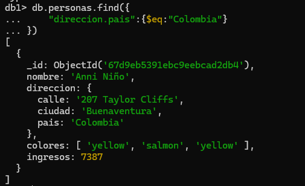
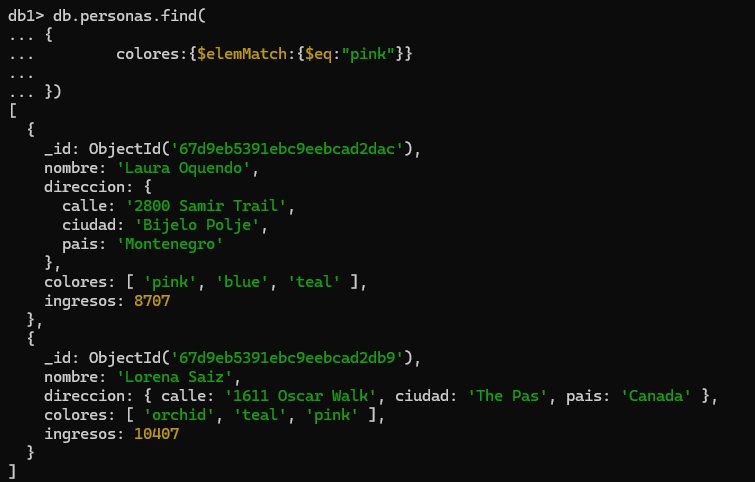
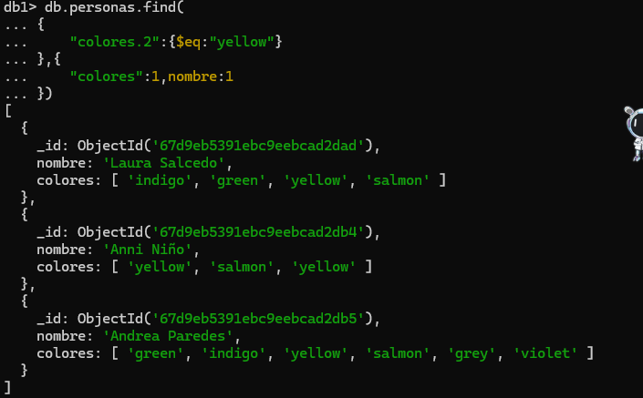
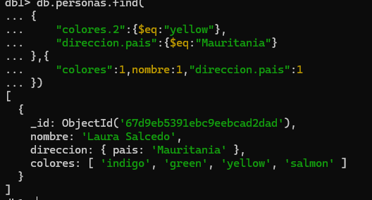
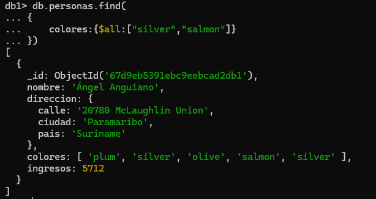
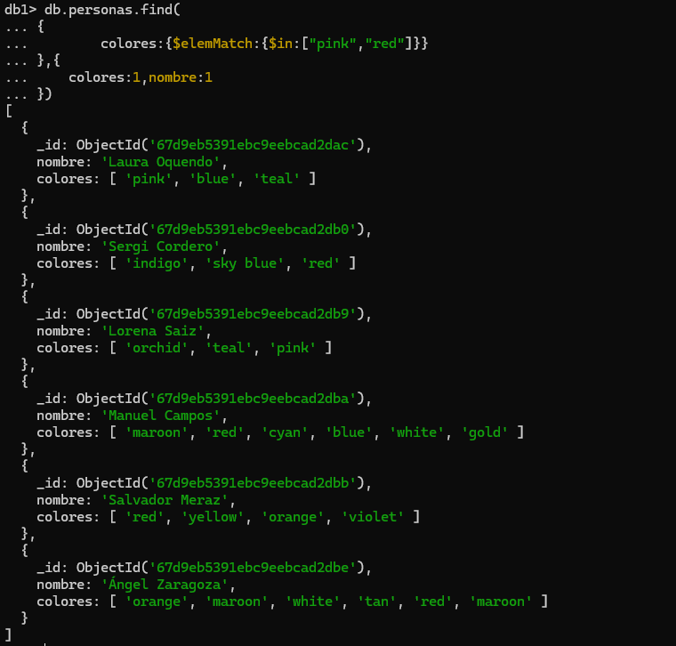

# 📌 Arrays y documentos anidados

## 📂 Datos Iniciales
1. Para hacer esta práctica vamos a cargar unos datos ficticios de empresas.

📁 [personas.json](.././data/personas.json)

2. Tienes un fichero denominado “personas.json”
3. Debes poner el resultado de las consultas en cada apartado

## 🔎 Consultas y Resultados
---
### 🔹 Buscar las personas que vivan en **Colombia**
```json
db.personas.find({
    "direccion.pais":{$eq:"Colombia"}  
})
```

---
### 🔹 Personas a las que le guste el color **rosa**
```json
db.personas.find(
{
        colores:{$eq:"pink"}
    
})
```
 
---
### 🔹 Personas cuyo **tercer color** preferido sea el **amarillo** (yellow)🟡. 
> 📌 **Nota:** Recuerda que los arrays comienzan por Cero. Deben salir 3
```json
db.personas.find(
{
    "colores.2":{$eq:"yellow"}
},{
    "colores":1,nombre:1
})
```

---
### 🔹 Personas cuyo **tercer color** preferido sea el **amarillo** (yellow) y que vivan en **Mauritania** 
> 📌 **Nota:** (debe salir uno)
```json
db.personas.find(
{
    "colores.2":{$eq:"yellow"},
    "direccion.pais":{$eq:"Mauritania"}
},{
    "colores":1,nombre:1,"direccion.pais":1
})
```

---
### 🔹 Usando el operador $all averiguar las personas que les gusta el **plata** (silver) y el **salmon** (salmon)
```json
db.personas.find(
{
    colores:{$all:["silver","salmon"]}
})
```
 
---
### 🔹 Con el operador $elemMatch, averigua las personas que les guste el **rosa** (Pink) o el **rojo** (red)
```json
db.personas.find(
{
        colores:{$elemMatch:{$in:["pink","red"]}}
},{
    colores:1,nombre:1
})
```
 
---