# 📌 Agregaciones
## 📂 Datos Iniciales
1. Para hacer esta práctica vamos a cargar unos datos ficticios de empresas.

📁 [productos.json](.././data/productos.json)

2. Tienes un fichero denominado “productos.json”
3. Debes poner el resultado de las consultas en cada apartado

## 🔎 Consultas y Resultados
---
### 🔹 Cuenta los productos de tipo **“medio”**, usando un método básico
```json
db.productos.countDocuments({tipo:{$eq:"medio"}})
```
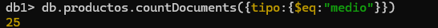
---
### 🔹 Indicar con un distinct, las empresas (**fabricantes**) que hay en la colección
```json
db.productos.distinct("fabricante")
```
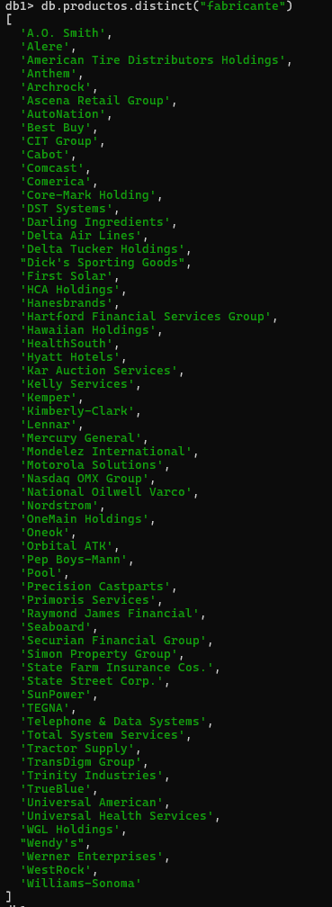
---
### 🔹 Usando aggregate, visualizar los productos que tengan **más de 80 unidades**
```json
db.productos.aggregate(
    [
       {
        $match:{unidades:{$gt:80}}
     },
    {
        $project:{
            nombre:1,
            unidades:1
        }
    }
    ]
)
```
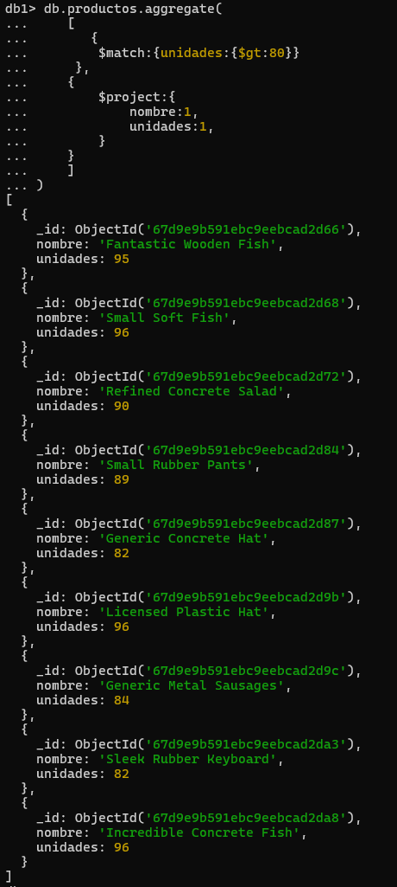
---
### 🔹Con $project visualizar solo el *nombre*, *unidades* y *precio* de los productos que tengan **menos de 10 unidades**
```json
db.productos.aggregate(
    [
       {
        $match:{unidades:{$lt:10}}
     },
    {
        $project:{
            _id:0,
            nombre:1,
            unidades:1,
            precio:1
        }
    }
    ]
)
```
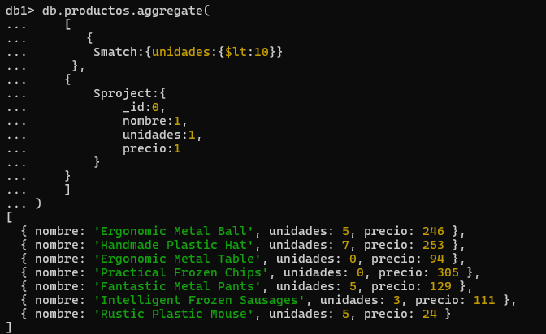
---
### 🔹 Con $project ponemos el fabricante pero le cambiamos el nombre por *“empresa”*. Usamos el mismo comando anterior
```json
db.productos.aggregate(
    [
       {
        $match:{unidades:{$lt:10}}
     },
    {
        $project:{
            _id:0,
            nombre:1,
            unidades:1,
            precio:1,
            empresa:"$fabricante"
        }
    }
    ]
)
```
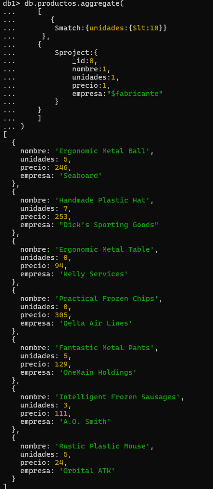
---
### 🔹 Añadir a la consulta anterior un campo calculado que se llame total y que multiplique precio por unidades.
```json
db.productos.aggregate(
    [
       {
        $match:{unidades:{$lt:10}}
     },
    {
        $project:{
            _id:0,
            nombre:1,
            unidades:1,
            precio:1,
            empresa:"$fabricante",
            Total: {
          $multiply: ["$precio", "$unidades"]
        }
        }
    }
    ]
)
```
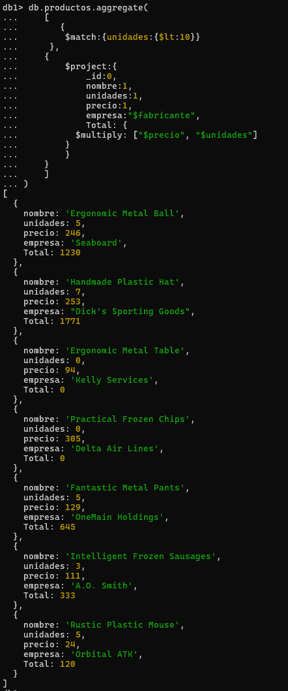
---
### 🔹 Hacer que el nombre salga en mayúsculas con el operador $toUpper
```json
db.productos.aggregate(
    {
        $project:{
            _id:0,
            nombre:1,
            nobreM:{$toUpper:"$nombre"}
        }
    }
)
```
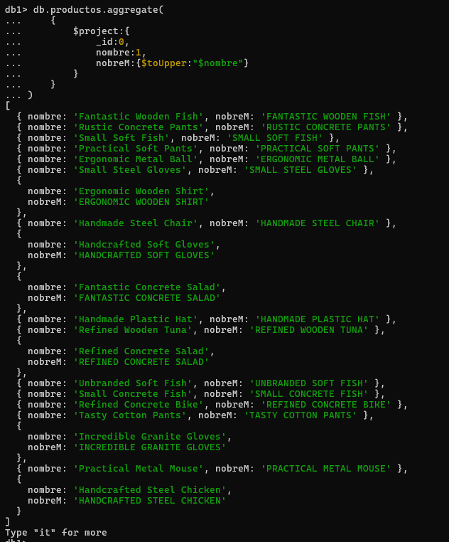
---
### 🔹 Añadir un campo calculado que ponga el nombre del producto y el tipo concatenado con el operador $concat. Le llamamos al campo “completo”
```json
db.productos.aggregate(
    {
        $project:{
            _id:0,
            nombre:1,
            tipo:1,
            completo:{ $concat: [ "$nombre" ," ", "$tipo" ] }
        }
    }
)
```
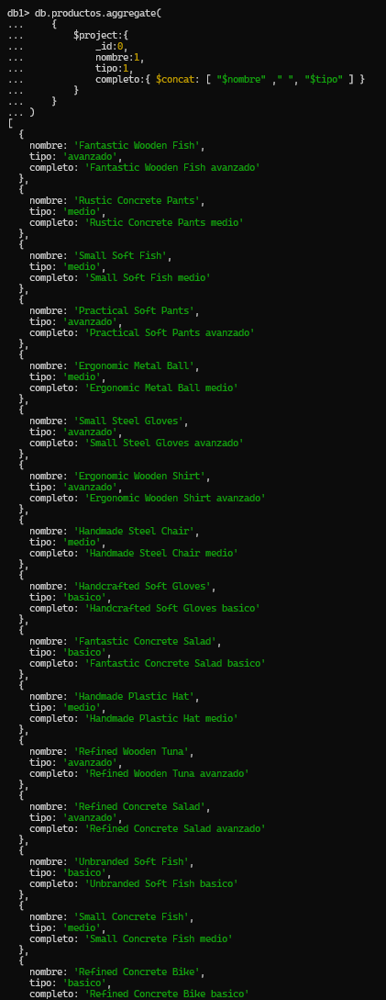
---
### 🔹 Ordena el resultado por el campo “total”
```json
db.productos.aggregate(
    [{
        $project:{
            _id:0,
            completo:{ $concat: [ "$nombre" ," ", "$tipo" ] },
            unidades:1,
            precio:1,
            Total: {
          $multiply: ["$precio", "$unidades"]
        }
        }},
        {
    $sort:
      {
        Total: -1
      }
  }
    ]
)
```
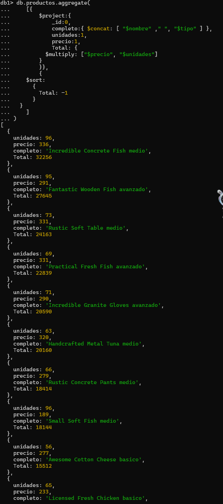
---
### 🔹 Haciendo una nueva consulta, averiguar el numero de productos por tipo de producto
```json
db.productos.aggregate(
[
  {
    $group:
      {
        _id: "$tipo",
        "Numero documentos": {
          $count: {}
        }
      }
  }
]
)
```
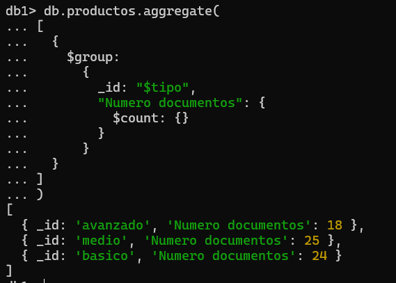
---
### 🔹 Añadir el valor mayor y el menor
```json
db.productos.aggregate(
[
  {
    $group:
      {
        _id: "$tipo",
        "Numero documentos": {
          $count: {}
        },
        maximo: { $max: "$unidades" },
        minimo: { $min: "$unidades" }
      }
  }
]
)
```
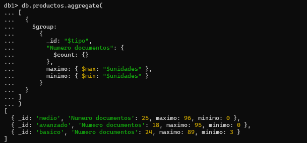
---
### 🔹  Añade el total de unidades por cada tipo
```json
    db.productos.aggregate(
    [
    {
        $group:
        {
            _id: "$tipo",
            "Numero documentos": {
            $count: {}
            },
            maximo: { $max: "$unidades" },
            minimo: { $min: "$unidades" },
            total: { $sum: "$unidades" }
        }
    }
    ]
    )
```
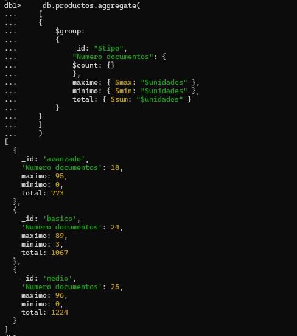
---
### 🔹 Con el operador $set y el operador “$substr” visualiza todos los datos del producto "Small Metal Tuna" y los primeros 5 caracteres del nombre.
```json
db.productos.aggregate([
  {
    $match: { nombre: "Small Metal Tuna" }
  },
  {
    $set: { primeros5: { $substr: ["$nombre", 0, 5] } }
  }
])
```
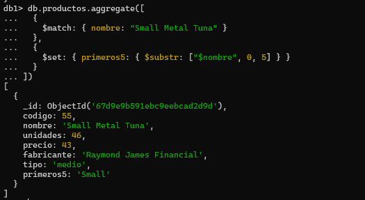
---
### 🔹Creamos una salida que tenga el nombre del articulo y el total (precio por unidades) y lo guardamos en una colección denominada productos2
```json
db.productos.aggregate([
  {
    $project: {
      _id: 0,
      nombre: 1,
      total: { $multiply: ["$precio", "$unidades"] }
    }
  },
  {
    $out: "productos2"
  }
])
```
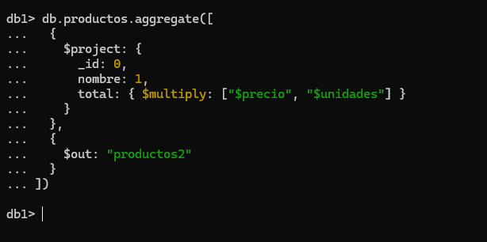
---
### 🔹 Comprobamos que se ha creado
```json
show collections
```
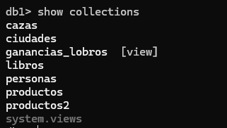
---
### 🔹 Hacemos un find para comprobar el resultado
```json
db.productos2.find({})
```

---
### 🔹Usando $cond y $project vamos a visualizar el nombre del producto, el precio y un campo llamado valoración que ponga “barato” si el precio es menor de 250 y caro si es mayor o igual
```json
db.productos.aggregate(
[
  {
    $project:
      /**
       * specifications: The fields to
       *   include or exclude.
       */
      {
        _id: 0,
        nombre: 1,
        precio: 1,
        room_type: 1,
        Barato: {
          $cond: [
            {
              $lt: ["$precio", 250]
            },
            "Si",
            "NO"
          ]
        },
        Caro: {
           $cond: [
            {
              $gte: ["$precio", 250]
            },
            "Si",
            "NO"
          ]
        }
      }
  }
])
```
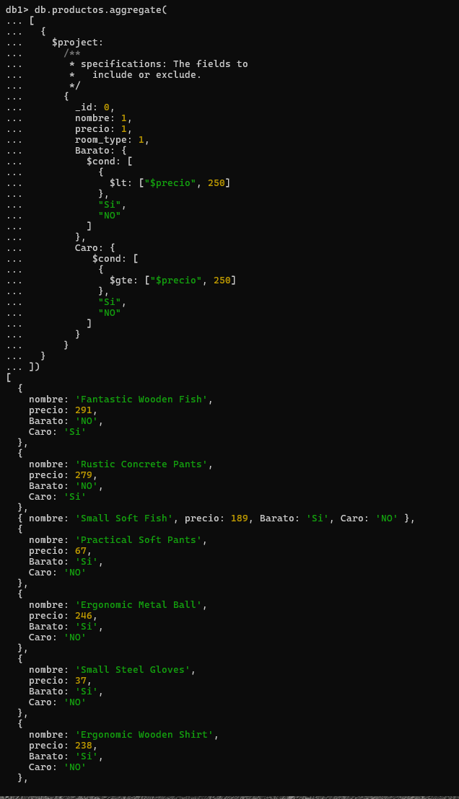